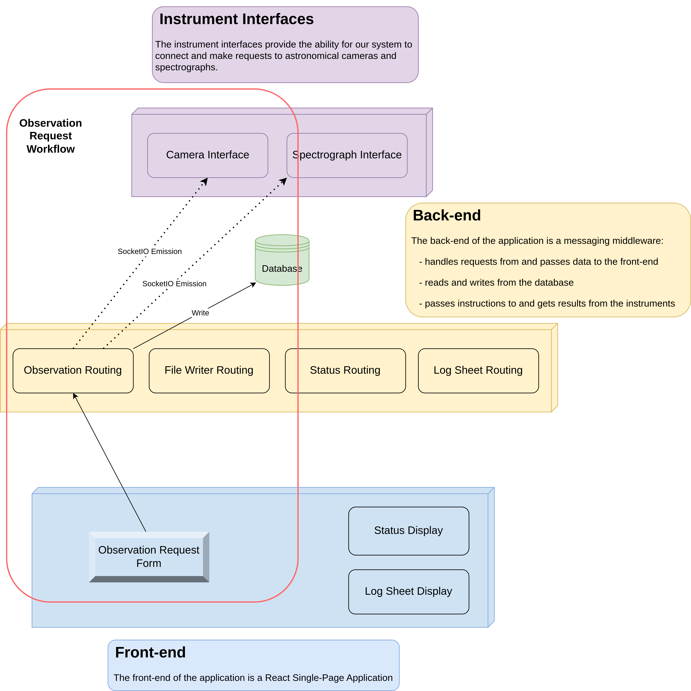

# Developers Guide
## Technologies
This application uses
- React: front-end
- Flask: back-end
- PostgreSQL: database
- [Create React App](https://create-react-app.dev): front-end build system
- Docker: containerization

## Architecture <sub><sup>`v0.2`</sup></sub>

The diagram below displays incomplete depictions of the various parts of the system. They are incomplete in the sense that each subsystem, e.g. the back-end, does not display all of the modules it is composed of nor does it display all of the connections to other modules in other subsystems.

The purpose of this diagram is to provide a general overview of the architecture of the application and what each layer or subsystem is responsible for.




## Getting Started
### Flask Blueprints
#### What are they
Blueprints are the Flask version of components. It defines a related set of functions, paired with URLs, all under a
URL subdomain. These are essential in defining new parts of code while maintaining structure and modularity. Everything
inside of a blueprint is essentially standalone, and does not affect code outside of the blueprint.

#### Creating a New Blueprint
1. Create a new directory in the `/api/main/` subdirectory. The name of this blueprint should be in [snake case](https://en.wikipedia.org/wiki/Snake_case).

2. Create two files in this directory titled `__init__.py` and v`iews.py`. The `__init__` file allows Flask to see this as a blueprint, while `views.py` is where the routing logic should go.

    a. In `__init__.py`, copy the format of the example_blueprint, or the following:

    ```python
    from Flask import Blueprint
    example = Blueprint('example', __name__) # Constructor where 'example' is the name of the blueprint
    from . import views # imports all of the routes from views
    ```

    b. in `views.py`, some example code would be:

    ```python
    from . import example_blueprint
    # from models import {needed database models}

    @example.route('/')
    def index():
        # Code here
        return ""

    @example.route('/get')
    def get():
        # Code here
        return ""
    ```

    where the route will have the URL of the desired endpoint.

3. Finally, add this blueprint in the parent level `__init__.py` with the line:

    ```python
    app.register_blueprint( example, url_prefix="/api/example" )
    ```

    The first argument is the name of the object created in the `__init__.py` file *of the blueprint*, and the url_prefix is the prefix added to all of the routes in the local `views.py` folder.
